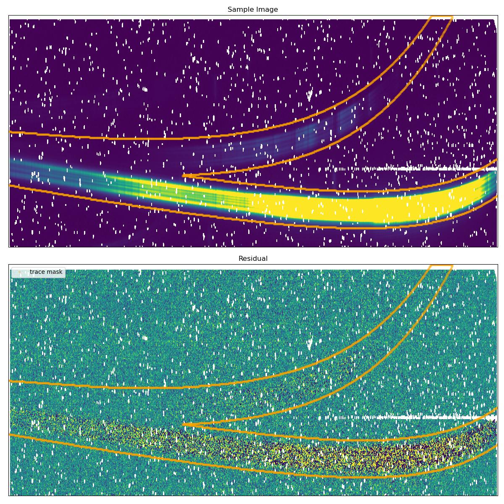

# SOSSISSE - SOSS Inspired SpectroScopic Extraction

## Table of contents

1. [Installation](#1-installation)
2. [Setup and first time use](#2-setup-and-first-time-use)
3. [How to use](#3-how-to-use)
4. [Description of code](#4-description-of-code)
5. [Example data set](#5-example-data-set)
6. [Understanding outputs](#6-understanding-outputs)
7. [Dev mode](#7-dev-mode)

---

## 1. Installation

#### Step 1: Download the GitHub repository

```bash
git clone git@github.com:njcuk9999/sossisse.git
```

or if this doesn't work try:

```bash
git clone https://github.com/njcuk9999/sossisse.git
```

#### Step 2: Make a new environment (recommended)

Using conda, create a new environment and activate it.

Note one can also use venv (instead of conda) or use a current environment but
we recommend a new clean environment to avoid module conflicts.


```bash
conda create --name sossisse-env python=3.11
```

```bash
conda activate sossisse-env
```

Note you need to activate `sossisse-env` each time before running any sosssise command.

#### Step 3: Install sossisse with pip 

Make sure you are in `sossisse-env` conda environment (or equivalent) and then run:

```
cd {SOSSISSE_ROOT}

pip install -U -e .[full]
```

Note `{SOSSISSE_ROOT}` is the path to the cloned GitHub repository (i.e. `/path/to/sossisse`)
if you are in the directory where you did your `git clone` then you need to change directory into the `sossisse` directory.


[Back to top](#table-of-contents)

---

## 2. Setup and first time use

We've tried to make SOSSISSE as user-friendly as possible.

For first time use we recommend running the setup script to create a default configuration file and folder structure.

From inside the `sossisse-env` conda environment (or equivalanet), in any directory, run:

```bash
sossisse_setup
````

This should guide you through create a basic folder structure and a default configuration file.

You'll be asked for:
- The data directory to use (where input and output data is stored) [SOSSIOPATH]
- The input name of the object directory (usually your object name) [OBJECTNAME]
- The instrument mode to use (either enter the number or the name) [INSTRUMENTMODE]
	 - 1: JWST.NIRISS.SOSS
	 - 2: JWST.NIRISS.FGS
	 - 3: JWST.NIRSPEC.PRISM
- Whether you want all the constants for all modes/settings added to the file (usually not)

You'll then be told what to do next:
```
 ********************************************************************************
 What to do next:
 ********************************************************************************
  1. Open the yaml file: {HOMEDIR}/.sossisse/run_setup_params.yaml
  2. Copy files to the correct directories:
           - calibrations: {SOSSIOPATH}/{INSTRUMENTMODE}/calibration
           - raw data: {SOSSIOPATH}/{INSTRUMENTMODE}/{OBJECTNAME}/rawdata
  3. Update the yaml parameters, for example:
           - FILES (raw data dir)
           - BKGFILE (calib dir, optional)
           - FLATFILE (calib dir, optional)
  3. Check every other value in the yaml file before running.
```

Note by default the yaml file is saved in the `~/.sossisse/` directory (i.e. your home directory).
You can move this yaml file anywhere on your system - it will be copied with your outputs when you run SOSSISSE.

Note `{HOMEDIR}`, `{SOSSIOPATH}`, `{INSTRUMENTMODE}` and `{OBJECTNAME}` will be filled by the code with the values you entered.

[Back to top](#table-of-contents)

---

## 3. How to use

Once you have run `sossisse_setup` and read and understood the yaml file you can run the main SOSSISSE code.

You can do this as follows:

```bash
sossisse_run {path_to_yaml_file}
```

where `{path_to_yaml_file}` is the path to the yaml file you created in the setup step.


### Advanced use / developer use

In the `sossisse/demos` directory there are several files that can aid in advanced use or in helping with development.
- There are three notebooks (a full demo, a break down of the white light curve steps, and a break down of the spectral extrction steps)
- There is a demo python code (similar to the full notebook demo)
- There is a example yaml file that is filled out and runs on one of our machines (it wont work on yours unless you correct the paths and have those specific files, but it can give you an indication on a working yaml file)

[Back to top](#table-of-contents)

---

## 4. Description of code

All parameters for the SOSSISSE code, from the inputs files to the detrending parameters, are passed through a 
single yaml file. One should not edit the python codes themselves, but rather edit the yaml file to change any 
relevant value. As it is likely that users will want to try  a number of parameter combinations, SOSSISSE creates a 
unique hash key for each parameter combination. This key is used to name the output files and folder name. The 
hash key is not meant to be an explicit description of the parameter combination, but rather a unique identifier. 
The hash key (SID) is created from the date it was first run - so can either be used again or multiple created. SOSISSE will
look for previous setups with the exact same parameter file and use this as the SID if an SID is not given, this prevents
every run creating a new set of directories. A yaml file is copied to each SID directory as a reminder of which parameters
were used (as the SID alone does not given this information).

Here are the main steps of the analysis :

- **Step 1** : Read the yaml file and check that all the parameters are present and have the correct format.

- **Step 2** : Read the raw data and the calibration files. The raw data are read as a cube of 3D images. The
calibration files are read as a cube of 2D images. The calibration files are used to construct a master flat field
and a master bad pixel mask. The master flat field is used to correct for the pixel-to-pixel variations in the
detector response. We use the per-pixel QC value to flag bad pixels. We correct the raw 
data for the flat field and the bad pixels.

- **Step 3** : Construct a normalized reference trace. This is done by medianing all the frames in the raw data 
cube. This is done iteratively as one expects the amplitude to change slightly from frame to frame.

- **Step 4** : Construct derivatives of the trace with respect to the detrending parameters. This assumes that the 
trace only in its morphology by very small amounts and that linear perturbations are sufficient to model it through 
time. Of course this assumption is expected to break at some point, if only because of the chromatic nature of 
transits, but this will be captured by the residual map.

- **Step 5** : Construct a model of the trace. This is done by adding the perturbation terms to the normalized trace.

- **Step 6** : Construct a residual map. This is done by subtracting the trace model from the raw data.

- **Step 7** : Subtract low-level detector noises (column-wise offset or gradients) from the residual map. This is 
done by fitting a low-order polynomial to the residual map and subtracting it (see corresponding parameter in yaml).

- **Step 8** : Construct a 1D spectrum of the residuals. This is done by summing the flux in the *y* direction and 
accounts for the variations in the noise level from pixel to pixel (1/$\sigma^2$ weighting). Errors are also propagated.

- **Step 9** : Construct a 1D spectrum of the trace model. This is done by summing the flux in the *y* direction 
and provides an SED estimate.

#### Data structure

If one has run the `run_setup` script a folder structure will be created in the directory where the script was run.
As mentioned in `run_setup` you must:
  1. Open the yaml file: /home/cook/.sossisse/run_setup_params.yaml
  2. Copy files to the correct directories:
           - calibrations: /scratch3/jwst-test/data/JWST.NIRISS.SOSS/calibration
           - raw data: /scratch3/jwst-test/data/JWST.NIRISS.SOSS/t1b/rawdata
  3. Update the yaml parameters, for example:
           - FILES (raw data dir)
           - BKGFILE (calib dir, optional)
           - FLATFILE (calib dir, optional)
  3. Check every other value in the yaml file before running.


The created folder structure will be as follows: 

```
{SOSSIOPATH}/{INSTRUMENTMODE}/
{SOSSIOPATH}/{INSTRUMENTMODE}/{OBJECTNAME}/
{SOSSIOPATH}/{INSTRUMENTMODE}/{OBJECTNAME}/rawdata/
```

where `t1b` is the name of the target (in this case `t1b` for Trappist-1b).
where `{SOSSIOPATH}`, `{INSTRUMENTMODE}` and `{OBJECTNAME}` are the values you entered when running `run_setup` ([here](#how-to-use))

[Back to top](#table-of-contents)

---

## 5. Example data set

The sample dataset provided as a demonstration of the code is the transit of TRAPPIST-1b observed with the SOSS mode.
The data is saved in two fits files (rateints data product) that sample 150 frames. The transit happens between 
frames 90 and 110 (1st and 4th contact) with a depth of ~0.88%. The point-to-point RMS of the white light curve over 
the SOSS domain is ~160 ppt.

For this example data set:
- [SOSSIOPATH] = /YourPath/Your_SOSSISSE_folder/
- [INSTRUMENTMODE] = JWST.NIRISS.SOSS
- [OBJECTNAME] = t1b

Within the `/YourPath/Your_SOSSISSE_folder/JWST.NIRISS.SOSS/t1b/rawdata/` folder, you should place the raw data files.

A demo dataset (Trappist-1b) can be dowloaded from http://www.astro.umontreal.ca/~artigau/soss/t1b_sample.tar. 

You will also need to put reference files, in the relevant subfolders, that can be downloaded from http://www.astro.umontreal.ca/~artigau/soss/ref_files.tar.
Place them for example in the following folder: `/YourPath/Your_SOSSISSE_folder//JWST.NIRISS.SOSS/calibrations/*.fits `

[Back to top](#table-of-contents)

---


## 6. Understanding outputs

#### White light curve
The first step of the code being a determination of the *grey* lightcurve, we first have a photometric curve with an 
obvious transit signature. Note that the time axis is in 'frames', which correspond to the **it**, 'in transit', 
parameters (4 terms; Nth frame for 1st, 2nd, 3rd and 4th contact). In this plot, the values measured between 1st and 4th contact 
are in red while baseline (before 1st and after 4th) are coded in green.


**Figure 1.** White light curve for the transit with color coding to highlight 'in' and 'out' of transit data. A rough fit 
of the transit depth is also shown.

#### 2D trace and residual image
The logic behind SOSSISSE is to construct a model of the trace and subtract it from the data. The model is 
constructed as a fixed-structure trace onto which we add a perturbation terms on a given number of parameters that 
are constructed as the derivatives of the trace with respect to the perturbation parameters. In the most simplistic 
case, one could recenter the trace by adding onto it the spatial derivative of the trace with respect to the *x* and 
*y* axis of the pixel grid. To understand systematics that are unaccounted for by this model, we construct a 
residual map of the data after the subtraction of the model. This residual map is then used to remove some low-level 
residuals such as  leftover sky residuals, or low-level detector effects. The residual map encodes spectral 
information on the transit signal.



** Figure 2.** [top] Sample 2D image of the trace with a highlighted region where the trace is scaled in amplitude. The 
white 
pixels correspond to NaN values (i.e. pixels that are not used in the analysis). [bottom] Same as Figure 2 but following the subtraction of the scaled trace model and residual low-level 
structures.  This image encodes the planet spectroscopic signal. Noise levels vary from pixel to pixel and is taken 
into account 
when extracting the 1D *residual* spectrum.

#### Detrending parameter drifts
As an ancillary output, we provide the amplitude of all terms used in the detrending model. The parameters against 
which we detrend are the *x* and *y* position of the trace, the *x* and *y* position of the trace center, the 
rotation of the trace, the trace amplitude, a pedestal to the trance and the trace width. The amplitude of the linear 
drifts for each of these 
are shown in Figure 3. The red points correspond to in-transit data. One sees that the trace center offsets in *x* 
are affected by periodic variations that are linked to the ~200s periodic error in the primary mirror shape [ref].


**Figure 3.** Amplitude of linear drifts for each detrending parameter. The red points correspond to in-transit data.

#### Per-order spectral energy distribution
 This is done as a 'convenience' output as the main goal of 
SOSSISSE is to get a very accurate *differential* extraction of the planet spectrum. This can be used to confirm the 
 wavelength calibration, which is not possible directly in residual space. The SED is constructed by summing the 
 flux in the *y* direction for each order. The SED is then normalized to the median flux in the out-of-transit data. 
 The SED accounts for the wavelength-dependent throughput of the instrument.


**Figure 4.** Spectral energy distribution for each order.

[Back to top](#table-of-contents)

---

## 7. Dev mode

For dev mode (editable install of both apero-core and sossisse) please run the following:

```bash

git clone git@github.com:njcuk9999/apero-drs.git
git clone git@github.com:njcuk9999/sossisse.git

pip install -U -e ./apero-drs/apero-core
pip install -U -e ./sossisse[dev]
```


[Back to top](#table-of-contents)

---